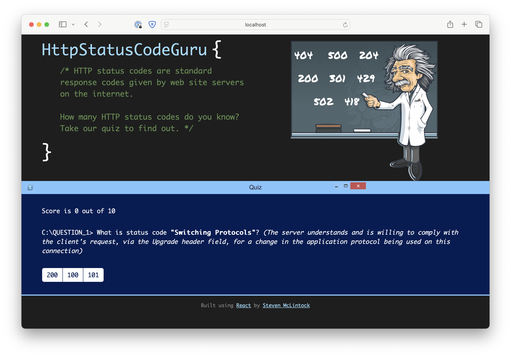

# HTTP Status Code Guru _(React Quiz)_

This simple React app _(built many years ago when I first learnt React)_ will help you learn the HTTP status codes and their definitions.

There are _(many)_ refactors and improvements that could be made, and likely a bug or two, however it still remains a fun quiz to try out.



To try it out, please run the commands:

```
npm install
npm start
```